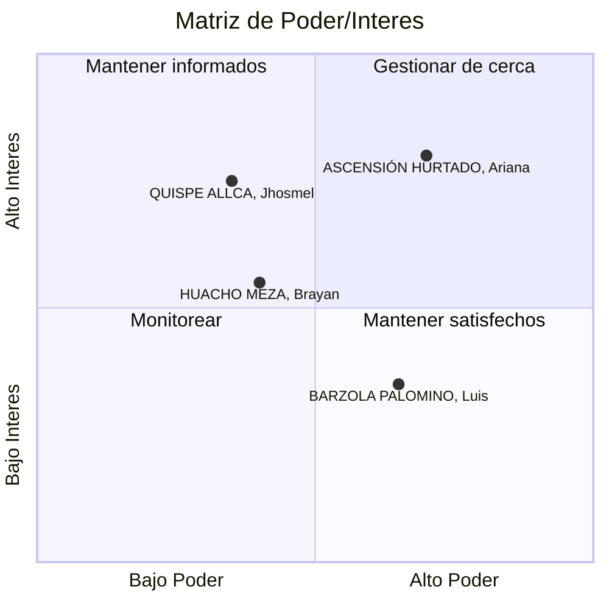

# 👥Análisis de Stakeholders

### Registro de Interesados

| ID  | Nombre                    | Puesto     | Departamento / Área          | Email                    | Teléfono  | Expectativas, Requisitos o Intereses                                                                                                                             | Impacto | Influencia | Rol del Proyecto         | Tipo de Relación y Seguimiento                                                                                                        |
| --- | ------------------------- | ---------- | ---------------------------- | ------------------------ | --------- | ---------------------------------------------------------------------------------------------------------------------------------------------------------------- | ------- | ---------- | ------------------------ | ------------------------------------------------------------------------------------------------------------------------------------- |
| 001 | QUISPE ALLCA, Jhosmel     | Estudiante | Facultad de Ingeniería       | jhosmel.quispe@gmail.com | 944975522 | Poder comprender textos técnicos y científicos complejos de manera más eficiente y en menos tiempo.                                                              | A       | B          | Usuario Final Primario   | Encuestas de satisfacción y grupos focales trimestrales para recoger feedback sobre la usabilidad y efectividad.                      |
| 002 | HUACHO MEZA, Brayan       | Docente    | Departamento de Literatura   | brayan.huacho@gmail.com  | 985745869 | Contar con una herramienta que complemente sus clases permitiéndole asignar lecturas y monitorear el progreso y comprensión de sus estudiantes.                  | M       | M          | Usuario Final Secundario | Talleres de capacitación sobre el uso de la plataforma. Reuniones bimensuales para ajustar contenidos según necesidades curriculares. |
| 003 | ASCENSIÓN HURTADO, Ariana | Estudiante | Facultad de Derecho          | david.ascencio@gmail.com | 975846213 | Analizar y sintetizar fallos judiciales y textos legales densos para mejorar su capacidad de argumentación jurídica.                                             | A       | A          | Usuario Final Primario   | Pruebas piloto de nuevas funcionalidades. Canal directo para reportar errores o sugerir mejoras.                                      |
| 004 | BARZOLA PALOMINO, Luis    | Docente    | Departamento de Comunicación | ariana.vargas@gmail.com  | 947856854 | Integrar el tutor al plan curricular de su departamento y asegurar que los contenidos sean pedagógicamente sólidos y alineados con los objetivos de aprendizaje. | A       | B          | Sponsor Académico        | Reuniones de coordinación semanal durante el desarrollo. Validación final de los módulos de contenido antes de su implementación.     |

---

### Matriz de Poder/Interés

---

### Plan de Gestión de Expectativas y Estrategias de Comunicación

#### **Cuadrante 1: Gestionar de cerca** (Alto Poder + Alto Interés)

**Stakeholder:** ASCENSIÓN HURTADO, Ariana (003)

- **Perfil:** Estudiante de Derecho con alta capacidad de influencia en su comunidad académica y alto interés en herramientas de análisis crítico
- **Expectativas:** Herramientas específicas para análisis jurídico, síntesis de textos legales complejos
- **Estrategia de comunicación:**
  - Canal directo de comunicación (WhatsApp/Telegram)
  - Participación en pruebas piloto de nuevas funcionalidades
  - Reuniones mensuales para retroalimentación
  - Prioridad en atención de sugerencias y reportes de errores
- **Gestión de expectativas:**
  - Definir claramente el alcance de las funcionalidades legales en la fase inicial
  - Establecer roadmap compartido con fechas de implementación de mejoras
  - Involucrar en decisiones de diseño de funcionalidades para el área jurídica

---

#### **Cuadrante 2: Mantener satisfechos** (Alto Poder + Bajo Interés relativo)

**Stakeholder:** BARZOLA PALOMINO, Luis (004)

- **Perfil:** Docente del Departamento de Comunicación, sponsor académico con poder de decisión curricular
- **Expectativas:** Alineación pedagógica, integración curricular, solidez de contenidos
- **Estrategia de comunicación:**
  - Reuniones semanales durante desarrollo, mensuales en fase de operación
  - Informes ejecutivos de avance
  - Validación previa de todos los módulos de contenido
  - Presentaciones formales de resultados y métricas de impacto
- **Gestión de expectativas:**
  - Establecer criterios pedagógicos claros desde el inicio
  - Proceso formal de validación de contenidos antes de implementación
  - Demostrar ROI educativo con métricas cuantificables

---

#### **Cuadrante 3: Monitorear** (Bajo Poder + Bajo Interés relativo)

**Stakeholder:** HUACHO MEZA, Brayan (002)

- **Perfil:** Docente de Literatura, usuario secundario con interés moderado en complementar sus clases
- **Expectativas:** Herramienta complementaria para asignación y monitoreo de lecturas
- **Estrategia de comunicación:**
  - Talleres de capacitación al inicio (onboarding)
  - Reuniones grupales con otros docentes
  - Newsletter con novedades y mejores prácticas
  - Soporte técnico vía email/tickets
- **Gestión de expectativas:**
  - Enfocarse en facilidad de uso y tiempo de adopción mínimo
  - Demostrar valor agregado vs métodos tradicionales
  - Proveer materiales de capacitación autoguiados

---

#### **Cuadrante 4: Mantener informados** (Bajo Poder + Alto Interés)

**Stakeholder:** QUISPE ALLCA, Jhosmel (001)

- **Perfil:** Estudiante de Ingeniería, usuario final primario con alto interés en eficiencia de lectura
- **Expectativas:** Comprensión rápida de textos técnicos y científicos complejos
- **Estrategia de comunicación:**
  - Grupos focales para testing de usabilidad
  - Canal de feedback continuo (formularios, botón de sugerencias en app)
  - Comunicaciones broadcast con updates y nuevas funcionalidades
- **Gestión de expectativas:**
  - Clarificar que es una herramienta de apoyo, no reemplazo de lectura profunda
  - Establecer métricas realistas de mejora en comprensión
  - Campañas educativas sobre uso efectivo de la plataforma

---

### Estrategias de Comunicación Diferenciadas

| Grupo de Stakeholders              | Frecuencia          | Canales                              | Formato                             | Contenido Clave                                           |
| ---------------------------------- | ------------------- | ------------------------------------ | ----------------------------------- | --------------------------------------------------------- |
| **Sponsors Académicos**            | Semanal/Quincenal   | Email formal, Reuniones presenciales | Informes ejecutivos, Presentaciones | Avances, métricas de impacto, validaciones pendientes     |
| **Docentes Usuarios**              | Bimensual           | Talleres, Email, Plataforma          | Capacitaciones, Newsletters         | Nuevas funcionalidades, mejores prácticas, casos de éxito |
| **Estudiantes Usuarios Primarios** | Trimestral/Continuo | App, Encuestas, Grupos focales       | Formularios, Notificaciones push    | Feedback de usabilidad, nuevas features, tips de uso      |
| **Estudiantes Alta Influencia**    | Mensual             | Reuniones 1-1, Chat directo          | Conversaciones, Beta testing        | Co-creación, priorización de features, embajadores        |

---

El éxito del proyecto Yuyariy depende críticamente de una gestión proactiva de stakeholders. La matriz de Poder/Interés permite priorizar recursos de comunicación y engagement de manera eficiente, mientras que las estrategias diferenciadas aseguran que cada grupo reciba el nivel de atención y el tipo de información que necesita.
