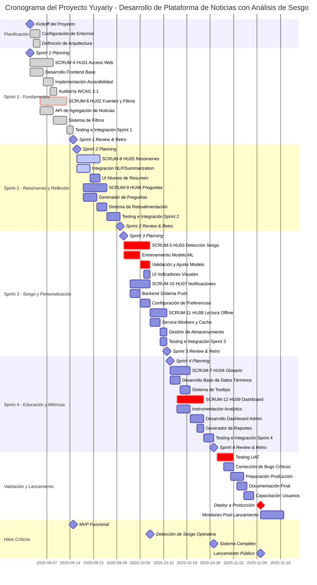

# Diagrama de Gantt - Proyecto Yuyariy



### 1. Ruta Crítica Identificada

La ruta crítica del proyecto incluye las siguientes tareas secuenciales:

```
Configuración → SCRUM-6 (HU02) → SCRUM-5 (HU03) → SCRUM-12 (HU09) → UAT → Despliegue
```

**Duración total de la ruta crítica:** 70 días (02/Sep/25 - 10/Nov/25)

**Tareas críticas:**

- **SCRUM-6 (HU02):** Base para todas las funcionalidades posteriores
- **SCRUM-5 (HU03):** Diferenciador clave del producto (detección de sesgo)
- **SCRUM-12 (HU09):** Requiere datos de todas las funcionalidades
- **Testing UAT:** Validación final antes de producción

### 2. Asignación de Recursos

#### Equipo de Desarrollo

| Miembro                           | Sprint 1                  | Sprint 2            | Sprint 3                  | Sprint 4             |
| --------------------------------- | ------------------------- | ------------------- | ------------------------- | -------------------- |
| **MATIAS ZURIEL AQUINO CASTRO**   | SCRUM-4 (Frontend + A11y) | SCRUM-9 (Preguntas) | SCRUM-5 (UI Sesgo)        | SCRUM-7 (Glosario)   |
| **CESAR AUGUSTO ATACHAO VILCHEZ** | SCRUM-6 (Backend + API)   | SCRUM-8 (NLP)       | SCRUM-10 (Notificaciones) | Support + Testing    |
| **JAVIER PAUL FLORES TAIPE**      | Support + Testing         | Support + Testing   | SCRUM-11 (Offline)        | SCRUM-12 (Dashboard) |

**Capacidad por Sprint:**

- **Sprint 1-2:** 3 desarrolladores, carga balanceada
- **Sprint 3:** Carga alta (3 historias), requiere coordinación estricta
- **Sprint 4:** Enfoque en métricas y documentación

### 3. Desglose de Estructura de Trabajo (WBS)

```
1. Proyecto Yuyariy
   │
   ├── 1.1 Infraestructura Base
   │   ├── 1.1.1 Configuración de Entornos (Dev/Staging/Prod)
   │   ├── 1.1.2 CI/CD Pipeline
   │   ├── 1.1.3 Arquitectura de Microservicios
   │   └── 1.1.4 Base de Datos (Esquema inicial)
   │
   ├── 1.2 EP01 - Consumo y Accesibilidad
   │   ├── 1.2.1 SCRUM-4 (HU01) - Acceso Web
   │   │   ├── Frontend Base (React)
   │   │   ├── Responsive Design
   │   │   └──  Accesibilidad WCAG 2.1
   │   ├── 1.2.2 SCRUM-6 (HU02) - Fuentes y Filtros
   │   │   ├── API Agregación (Web Scraping)
   │   │   ├── Normalización de Datos
   │   │   ├── Sistema de Filtros
   │   │   └── Cache y Optimización
   │   ├── 1.2.3 SCRUM-8 (HU05) - Resúmenes
   │   │   ├── Integración NLP
   │   │   ├── Generación Multinivel
   │   │   └── UI de Resúmenes
   │   └── 1.2.4 SCRUM-7 (HU04) - Glosario
   │       ├── Base de Datos de Términos
   │       ├── Sistema de Tooltips
   │       └── Analytics de Consultas
   │
   ├── 1.3 EP02 - Pensamiento Crítico
   │   ├── 1.3.1 SCRUM-5 (HU03) - Detección de Sesgo
   │   │   ├── Recolección Dataset
   │   │   ├── Entrenamiento Modelo ML
   │   │   ├── Validación (>75% precisión)
   │   │   ├── API de Clasificación
   │   │   └── UI Indicadores Visuales
   │   └── 1.3.2 SCRUM-9 (HU06) - Preguntas Reflexivas
   │       ├── Generador de Preguntas
   │       ├── Sistema de Evaluación
   │       ├── Retroalimentación Personalizada
   │       └── Historial de Usuario
   │
   ├── 1.4 EP03 - Personalización
   │   ├── 1.4.1 SCRUM-10 (HU07) - Notificaciones
   │   │   ├── Backend Sistema Push
   │   │   ├── Web Push API
   │   │   ├── Configuración Preferencias
   │   │   └── Email Semanal
   │   ├── 1.4.2 SCRUM-11 (HU08) - Offline
   │   │   ├── Gestión de Cache
   │   │   └── Sincronización
   │   └── 1.4.3 SCRUM-12 (HU09) - Dashboard
   │       ├── Instrumentación Analytics
   │       ├── Dashboard Admin
   │       ├── Generador de Reportes
   │       └── Visualizaciones
   │
   ├── 1.5 Testing y Calidad
   │   ├── 1.5.1 Testing Unitario (por Sprint)
   │   ├── 1.5.2 Testing de Integración
   │   └── 1.5.3 Testing UAT
   │
   └── 1.6 Despliegue y Operaciones
       ├── 1.6.1 Preparación Producción
       ├── 1.6.2 Documentación
       ├── 1.6.3 Deploy
       └── 1.6.4 Monitoreo Post-Lanzamiento
```

### 4. Hitos de Validación

Aquí tienes la información organizada en una **tabla de hitos del proyecto Yuyariy**:

| **Sprint**      | **Periodo**     | **Objetivo Principal**                                  | **Historias Incluidas**                                                                               | **Story Points** | **Estado**     | **Comentarios Clave / Dependencias**                                                                                                                |
| --------------- | --------------- | ------------------------------------------------------- | ----------------------------------------------------------------------------------------------------- | ---------------- | -------------- | --------------------------------------------------------------------------------------------------------------------------------------------------- |
| 🟩 **Sprint 1** | 02/Sep – 15/Sep | Establecer infraestructura base y acceso a noticias     | - HU01: Acceso web y accesibilidad<br>- HU02: Comparación de fuentes y filtros                        | 7                | ✅ Completado  | Ambas historias fundacionales completadas. La accesibilidad permitirá auditorías continuas y los filtros serán base para la personalización futura. |
| 🟦 **Sprint 2** | 16/Sep – 29/Sep | Implementar resúmenes y pensamiento crítico inicial     | - HU05: Resúmenes multinivel<br>- HU06: Preguntas de reflexión crítica                                | 6–7              | 🔄 En progreso | Depende de HU02 (contenido disponible). Requiere integración con servicios de NLP.                                                                  |
| 🟧 **Sprint 3** | 30/Sep – 13/Oct | Añadir detección de sesgo y personalización             | - HU03: Indicadores de sesgo político<br>- HU07: Sistema de notificaciones<br>- HU08: Lectura offline | 9–10             | 📅 Planificado | Alta carga de trabajo; posible mover HU08 a Sprint 4. Requiere modelo de ML validado.                                                               |
| 🟨 **Sprint 4** | 14/Oct – 27/Oct | Completar herramientas educativas y sistema de métricas | - HU04: Glosario de términos<br>- HU09: Dashboard de métricas y reportes                              | 6–7              | 📅 Planificado | Entregables finales: sistema de análisis de impacto, herramientas educativas y preparación para beta pública.                                       |
